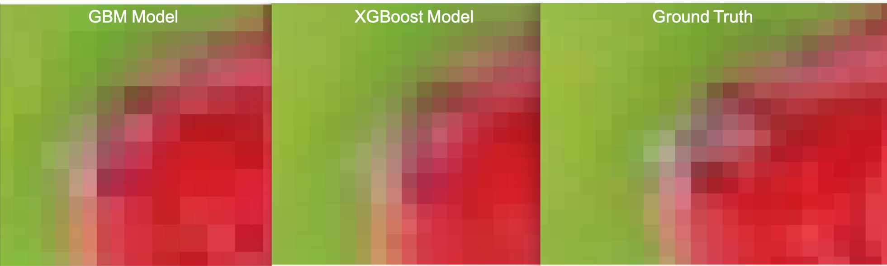
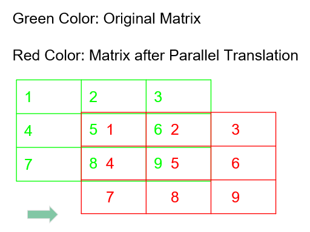

# Project: Can you unscramble a blurry image? 


### [Full Project Description](doc/project3_desc.md)

Term: Fall 2018

+ Team #2
+ Team members
	+ Jannie Chen (mc4398)
	+ Shilin Li   (sl4261)
	+ Yiding Xie  (yx2443)
	+ Yang Xing   (yx2416)
	+ Zhibo Zhou  (zz2520)

+ Project summary: In this project, we created and improved the regression engines to enhance the resolution of images. The train set includes 1500 images of high resolution and low resolution, respectively. At first, we improved the baseline model (GBM) by varying the depth from 1 to 11 and we determined 11 to be the optimal depth to use. The training time of baseline model is more than 6 hours. The test time of baseline model is around 53 minutes. Then, we applied the XGBoost model to get higher resolution. The training time and test time of XGBoost model are around 4 minutes and 35 seconds each. 

+ Models used:
	+ Baseline: GBM
	+ Improved: XGBoost

**Baseline Model (GBM)**
+ Feature extraction:


	
**Contribution statement**: ([default](doc/a_note_on_contributions.md)) All team members contributed equally in all stages of this project. All team members approve our work presented in this GitHub repository including this contributions statement. 

Following [suggestions](http://nicercode.github.io/blog/2013-04-05-projects/) by [RICH FITZJOHN](http://nicercode.github.io/about/#Team) (@richfitz). This folder is orgarnized as follows.

```
proj/
├── lib/
├── data/
├── doc/
├── figs/
└── output/
```

Please see each subfolder for a README file.
