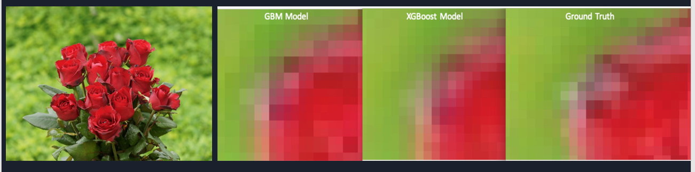
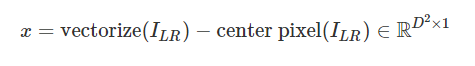
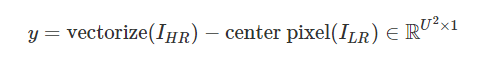
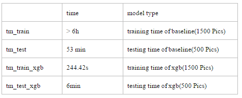

# Project: Can you unscramble a blurry image? 


### [Full Project Description](doc/project3_desc.md)

Term: Fall 2018

+ Team #2
+ Team members
	+ Jannie Chen (mc4398)
	+ Shilin Li   (sl4261)
	+ Yiding Xie  (yx2443)
	+ Yang Xing   (yx2416)
	+ Zhibo Zhou  (zz2520)

+ Project objective:
	+ Predict super-resolution images from its corresponding low-resolution images
	+ Two models need to be implemented: baseline (GBM) and improved (XGBoost)
	+ Model parameters are determined using cross validation
		+ Criteria: Small MSE, Large PSNR
		+ Maintaining speed

+ Project summary: In this project, we created and improved the regression engines to enhance the resolution of images. The train set includes 1500 images of high resolution and low resolution, respectively. At first, we improved the baseline model (GBM) by varying the depth from 1 to 11 and we determined 11 to be the optimal depth to use. The training time of baseline model is more than 6 hours. The test time of baseline model is around 53 minutes. Then, we applied the XGBoost model to get higher resolution. The training time and test time of XGBoost model are around 4 minutes and 35 seconds each. 

+ Models used:
	+ Baseline: GBM
	+ Improved: XGBoost
	+ Unfinisehd: SVM, Random Forest

+ Feature extraction:

+ FeatMat: 
	+ 
	+ 
	+ Instead of using for loops, we instead defined a particular direction, and then we tried to find a neighbor in that direction for every point in the whole matrix and subtracted that value from the corresponding center point. For example, in picture above, if the middle point is 5, then the value in its upper left direction should be 1-5. if the middle point is 6, then it should be 2-6.  We could then move the matrix to the opposite direction, which is lower right. After calculating (the new matrix – the original matrix), we could get the values from the upper left direction. We applied the similar idea 8 more times and get the featmat.

+ LabMat: 
	+ 
	+ 
	+ We successfully discovered the relationship between the two matrices above. For example, by extracting and aligning the 4 red pixels into one column, we are able to construct the LabMat matrix.


**Model Comparison**



Picture above shows the comparison in running time between the different models we utilized. 
	
**Contribution statement**: ([default](doc/a_note_on_contributions.md)) 

+ Jannie Chen: Designed and wrote the feature extraction algorithm. Wrote the XGBoost algorithm and finished the cross validation part for XGBoost. Wrote the random forest model and trained the model using a small sample. Do the prediction on the test set using baseline model. 

+ Shilin Li: Improved and  rewrote the feature extraction algorithm.  Trained and tuned the baseline model. Trained the XGBoost Algorithm as our improved model. Finished the superResolution part for GBM and XGBoost. Do the prediction on the test set using baseline model. 

+ Yiding Xie: Revised the feature extraction. Wrote the Supporting Vector Machine (SVM) model and trained the model using a small sample. Found and resized 50 pictures as the test set. Tested the baseline model and XGBoost improved model. Compared the two models and provided some advice. Do the prediction on the test set using baseline model.  

+ Yang Xing: Designed and wrote a different version of feature extraction algorithm. Finished the cross validation part of baseline model. Created the slides and prepared the presentation. Do the prediction on the test set using XGBoost model. Edited the github and uploaded the zipfiles.

+ Zhibo Zhou: Established and optimized the Convolution Neural Network (CNN) using tensorflow in Python. Trained the CNN model and output some high resolution pictures. Finished the Rmarkdown, Python code and output the PDF version. Do the prediction on the test set using XGBoost model. 

All team members contributed equally in all stages of this project. All team members approve our work presented in this GitHub repository including this contributions statement. 

Following [suggestions](http://nicercode.github.io/blog/2013-04-05-projects/) by [RICH FITZJOHN](http://nicercode.github.io/about/#Team) (@richfitz). This folder is orgarnized as follows.

```
proj/
├── lib/
├── data/
├── doc/
├── figs/
└── output/
```

Please see each subfolder for a README file.
